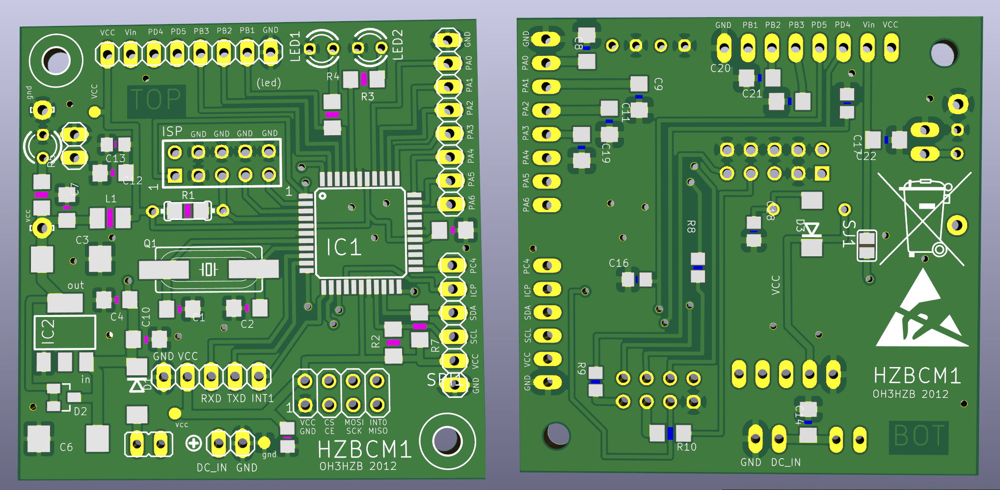

# HZBCM1
ATMEGA16/32 CPU board by Lasse OH3HZB 2012

Multi-purpose CPU board (dimensions 5cm x 5cm) for IoT applications.
Designed in Cadsoft Eagle some years ago (when they didn't call it
IoT yet :) Design files (.sch and .brd) should open at least with Eagle 7.70.

Released under the MIT license (see attached).
